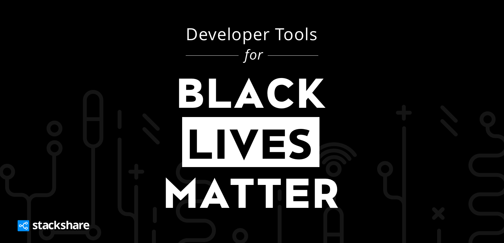

  

# Developer Tools for #BlackLivesMatter
A running list of developer tools companies supporting #BlackLivesMatter. For more info on ways you can help visit https://blacklivesmatters.carrd.co/.

Listing Order: alphabetical, with the companies matching donations first, companies donating second, followed by companies who have made a public statement (via Twitter).

| Company | Statement | Matching Donations? | Donating?
| :---         |     :---       | :---       |     :---       
|  
 **Dojo**    
  | <blockquote class="twitter-tweet">
Following in the footsteps of some great dev tool companies highlighted by <a href="https://twitter.com/stackshareio"> @stackshareio</a> at <a href="https://github.com/stackshareio/dev-tools-for-blm">dev-tools-for-blm</a> Dojo is continuing the call for equality by matching donations up to a total of $10,000 to <a href+"https://twitter.com/hashtag/blacklivesmatter?src=hashtag_click">#blacklivesmatter</a> <a href="https://twitter.com/hashtag/aclu?src=hashtag_click">#aclu</a> <a href="https://twitter.com/hashtag/eji?src=hashtag_click">#eji</a> <a href="https://twitter.com/hashtag/naacp?src=hashtag_click">#naacp</a> Learn more at <a href="https://dojo.io/blog/black-lives-matter">Dojo BLM blog</a></blockquote> |  
✅    [👉🏾 Donate here](https://dojo.io/blog/black-lives-matter)
   |  
✅ 

|  
 **Elastic**    
  | <blockquote class="twitter-tweet">
In solidarity with the Black community, we’re dedicating June 1 to the <a href="https://twitter.com/hashtag/BlackLivesMatter?src=hash&amp;ref_src=twsrc%5Etfw">#BlackLivesMatter</a> movement at Elastic.   Read the statement from our Founder and CEO, Shay Banon (<a href="https://twitter.com/kimchy?ref_src=twsrc%5Etfw">@kimchy</a>), and see how we’re empowering all <a href="https://twitter.com/hashtag/Elasticians?src=hash&amp;ref_src=twsrc%5Etfw">#Elasticians</a> to be allies. <a href="https://t.co/p97wV4hW8Y">https://t.co/p97wV4hW8Y</a>
&mdash; Elastic (@elastic) <a href="https://twitter.com/elastic/status/1267171496222437377?ref_src=twsrc%5Etfw">May 31, 2020</a></blockquote> |  
✅    [👉🏾 Donate here](https://elastic-cares.benevity.org/community/fundraiser/395)
   |  
✅ 

|  
 **Gatsby**    
  | <blockquote class="twitter-tweet">
💜We stand by our community and right now, many are hurting.   June 1-8, we&#39;ll match community and team members’ donations up to $25,000 USD to:  ◾<a href="https://twitter.com/ACLUMN?ref_src=twsrc%5Etfw">@ACLUMN</a>  ◾<a href="https://twitter.com/hashtag/BlackVisionsCollective?src=hash&amp;ref_src=twsrc%5Etfw">#BlackVisionsCollective</a>  ◾<a href="https://twitter.com/fairfightaction?ref_src=twsrc%5Etfw">@fairfightaction</a>  ◾<a href="https://twitter.com/hashtag/NorthStarHealthCollective?src=hash&amp;ref_src=twsrc%5Etfw">#NorthStarHealthCollective</a> ◾<a href="https://twitter.com/NAACP_LDF?ref_src=twsrc%5Etfw">@NAACP_LDF</a>  Details: <a href="https://t.co/1m7cn5HLrr">https://t.co/1m7cn5HLrr</a> <a href="https://t.co/Hn0PoAABgz">pic.twitter.com/Hn0PoAABgz</a>
&mdash; Gatsby (@GatsbyJS) <a href="https://twitter.com/GatsbyJS/status/1267493819383271425?ref_src=twsrc%5Etfw">June 1, 2020</a></blockquote> |  
✅    [👉🏾 Donate here](https://www.gatsbyjs.com/donation-matching/)
   |  
✅ 

|  
 **Netifly**    
  | <blockquote class="twitter-tweet">
Netlify stands in solidarity with the Black community to grieve the senseless murders of countless people. We will match donations of up to $25,000 to organizations who support this cause.  More information here: <a href="https://t.co/UUWwLoW9SC">https://t.co/UUWwLoW9SC</a>
&mdash; Netlify (@Netlify) <a href="https://www.netlify.com/donation-matching">June 3, 2020</a></blockquote> |  
✅    [👉🏾 Donate here](https://www.netlify.com/donation-matching)
   |  
✅ 

|  
 **React Training**    
  | <blockquote class="twitter-tweet">
<a href="https://twitter.com/hashtag/BlackLivesMatter?src=hash&amp;ref_src=twsrc%5Etfw">#BlackLivesMatter</a>   We have taken the React Router docs offline and want you to join us in donating to <a href="https://twitter.com/Blklivesmatter?ref_src=twsrc%5Etfw">@blklivesmatter</a>, <a href="https://twitter.com/eji_org?ref_src=twsrc%5Etfw">@eji_org</a>, and <a href="https://twitter.com/NAACP_LDF?ref_src=twsrc%5Etfw">@NAACP_LDF</a>.  DM us your receipt and we&#39;ll match it up to $10,000. <a href="https://t.co/v0P1sxzyJa">pic.twitter.com/v0P1sxzyJa</a>
&mdash; React Training (@ReactTraining) <a href="https://twitter.com/ReactTraining/status/1267561893167689728?ref_src=twsrc%5Etfw">June 1, 2020</a></blockquote> | 
✅    [👉🏾 Donate here](https://twitter.com/ReactTraining/status/1267561893167689728)
   |  
✅ 

|  
 **Amazon Web Services**    
  | <blockquote class="twitter-tweet">
Amazon stands in solidarity with the Black community — we remain steadfast in our support for our employees, customers, partners, and the communities where they live and work. And we stand in support of organizations that are making a difference. <a href="https://t.co/HyUIaY33IF">https://t.co/HyUIaY33IF</a> <a href="https://t.co/hxLnVsgjsD">pic.twitter.com/hxLnVsgjsD</a>
&mdash; Amazon Web Services (@awscloud) <a href="https://twitter.com/awscloud/status/1268269315587014657?ref_src=twsrc%5Etfw">June 3, 2020</a></blockquote> | 
 -   |  
✅ 

|  
 **HashiCorp**    
  | <blockquote class="twitter-tweet">
HashiCorp stands in solidarity with the Black community and we commit to being an ally in fighting racism, injustice &amp; violence—for our employees, partners, customers, and communities. We are donating to <a href="https://twitter.com/splcenter?ref_src=twsrc%5Etfw">@splcenter</a> + <a href="https://twitter.com/MNFreedomFund?ref_src=twsrc%5Etfw">@MNFreedomFund</a> in support of their efforts <a href="https://twitter.com/hashtag/blacklivesmatter?src=hash&amp;ref_src=twsrc%5Etfw">#blacklivesmatter</a>
&mdash; HashiCorp (@HashiCorp) <a href="https://twitter.com/HashiCorp/status/1267560855081803776?ref_src=twsrc%5Etfw">June 1, 2020</a></blockquote> | 
 -   |  
✅ 

|  
 **LaunchDarkly**    
  | <blockquote class="twitter-tweet">
To the Black members of our community, we see you. We are looking to move from compassion to action. <a href="https://t.co/Oau3LcmGZ5">https://t.co/Oau3LcmGZ5</a><a href="https://twitter.com/hashtag/BlackLivesMatter?src=hash&amp;ref_src=twsrc%5Etfw">#BlackLivesMatter</a> <a href="https://t.co/7wqyrPCqgL">pic.twitter.com/7wqyrPCqgL</a>
&mdash; LaunchDarkly (@LaunchDarkly) <a href="https://twitter.com/LaunchDarkly/status/1268174359761506304?ref_src=twsrc%5Etfw">June 3, 2020</a></blockquote> | 
 -   |  
✅ 

|  
 **Okta**    
  | <blockquote class="twitter-tweet">
<a href="https://t.co/kWJKvlgASl">pic.twitter.com/kWJKvlgASl</a>
&mdash; Okta (@okta) <a href="https://twitter.com/okta/status/1267920219231547392?ref_src=twsrc%5Etfw">June 2, 2020</a></blockquote> | 
 -   |  
✅ 

|  
 **Stripe**    
  | <blockquote class="twitter-tweet">
Racism is antithetical to Stripe’s mission. We stand with the Black community against discrimination and police violence. <a href="https://t.co/IfUPgQ5dsx">https://t.co/IfUPgQ5dsx</a>
&mdash; Stripe (@stripe) <a href="https://twitter.com/stripe/status/1267906850214670336?ref_src=twsrc%5Etfw">June 2, 2020</a></blockquote> | 
 -   |  
✅ 

|  
 **Atlassian**    
  | <blockquote class="twitter-tweet">
Click here to read our statement: <a href="https://t.co/uK2yekqRUi">https://t.co/uK2yekqRUi</a> <a href="https://t.co/7m0FxLrGIT">pic.twitter.com/7m0FxLrGIT</a>
&mdash; Atlassian (@Atlassian) <a href="https://twitter.com/Atlassian/status/1267479225617002497?ref_src=twsrc%5Etfw">June 1, 2020</a></blockquote> | 
 -   |  
 - 

|  
 **bugcrowd**    
  | <blockquote class="twitter-tweet">
We are all connected and stronger together. <a href="https://t.co/4E0g3iFm9w">pic.twitter.com/4E0g3iFm9w</a>
&mdash; bugcrowd (@Bugcrowd) <a href="https://twitter.com/Bugcrowd/status/1268202893976440835?ref_src=twsrc%5Etfw">June 3, 2020</a></blockquote> | 
 -   |  
 - 

|  
 **CircleCI**    
  | <blockquote class="twitter-tweet">
We hear you. We support you. We stand with you. Black Lives Matter. <a href="https://twitter.com/hashtag/blackouttuesday?src=hash&amp;ref_src=twsrc%5Etfw">#blackouttuesday</a> <a href="https://t.co/D71aRNeY6r">pic.twitter.com/D71aRNeY6r</a>
&mdash; CircleCI (@CircleCI) <a href="https://twitter.com/CircleCI/status/1267864469784260608?ref_src=twsrc%5Etfw">June 2, 2020</a></blockquote> | 
 -   |  
 - 

|  
 **Cloudflare**    
  | <blockquote class="twitter-tweet">
<a href="https://t.co/ftWJEYovBM">pic.twitter.com/ftWJEYovBM</a>
&mdash; Cloudflare (@Cloudflare) <a href="https://twitter.com/Cloudflare/status/1267912134618419200?ref_src=twsrc%5Etfw">June 2, 2020</a></blockquote> | 
 -   |  
 - 

|  
 **GitHub**    
  | <blockquote class="twitter-tweet">
This week has been a horrifying, sad reminder of the centuries-long pattern of systemic racism in the US. And that our criminal justice system is in dire need of reform. GitHub stands with the Black community and will not be silent on violence and injustice.
&mdash; Nat Friedman (@natfriedman) <a href="https://twitter.com/natfriedman/status/1266790816174882816?ref_src=twsrc%5Etfw">May 30, 2020</a></blockquote> | 
 -   |  
 - 

|  
 **GitKraken**    
  | <blockquote class="twitter-tweet">
<a href="https://twitter.com/hashtag/BlackLivesMatter?src=hash&amp;ref_src=twsrc%5Etfw">#BlackLivesMatter</a>. “As a company, we have a responsibility to let our customers where we stand. We stand for equality and justice. We stand with Black Lives Matter, a peaceful movement to end systemic racism towards Black people.” -<a href="https://twitter.com/axosoft?ref_src=twsrc%5Etfw">@axosoft</a> Founder <a href="https://twitter.com/hamids?ref_src=twsrc%5Etfw">@hamids</a> <a href="https://t.co/YnRIJRHTG0">https://t.co/YnRIJRHTG0</a>
&mdash; Axosoft GitKraken (@GitKraken) <a href="https://twitter.com/GitKraken/status/1268280541951991810?ref_src=twsrc%5Etfw">June 3, 2020</a></blockquote> | 
 -   |  
 - 

|  
 **GitLab**    
  | <blockquote class="twitter-tweet">
Being inclusive, building a safe community, and being an ally. We are leaning into these, as now more than ever it is important that we show compassion to all. <a href="https://twitter.com/hashtag/BlackLivesMatter?src=hash&amp;ref_src=twsrc%5Etfw">#BlackLivesMatter</a> <a href="https://t.co/0jjh7dQ01I">pic.twitter.com/0jjh7dQ01I</a>
&mdash; GitLab (@gitlab) <a href="https://twitter.com/gitlab/status/1267583578428375052?ref_src=twsrc%5Etfw">June 1, 2020</a></blockquote> | 
 -   |  
 - 

|  
 **HackerOne**    
  | <blockquote class="twitter-tweet">
&quot;When groups with power use violence against individuals lacking power, all human ideals break down. We are starkly reminded of the absolute necessity to never stop working for a better society.&quot; Statement from CEO <a href="https://twitter.com/martenmickos?ref_src=twsrc%5Etfw">@martenmickos</a>. <a href="https://twitter.com/hashtag/BlackLivesMatter?src=hash&amp;ref_src=twsrc%5Etfw">#BlackLivesMatter</a> <a href="https://t.co/eexXycazPD">https://t.co/eexXycazPD</a>
&mdash; HackerOne (@Hacker0x01) <a href="https://twitter.com/Hacker0x01/status/1268220210739363842?ref_src=twsrc%5Etfw">June 3, 2020</a></blockquote> | 
 -   |  
 - 

|  
 **Kong**    
  | <blockquote class="twitter-tweet">
Kong stands with <a href="https://twitter.com/hashtag/BlackLivesMatter?src=hash&amp;ref_src=twsrc%5Etfw">#BlackLivesMatter</a>. <a href="https://t.co/2y4LCP8IWs">pic.twitter.com/2y4LCP8IWs</a>
&mdash; Kong Inc. (@thekonginc) <a href="https://twitter.com/thekonginc/status/1267569862085246976?ref_src=twsrc%5Etfw">June 1, 2020</a></blockquote> | 
 -   |  
 - 

|  
 **Linkerd**    
  | <blockquote class="twitter-tweet">
To our Black, Indigenous, and People of Color members of the <a href="https://twitter.com/Linkerd?ref_src=twsrc%5Etfw">@Linkerd</a> community: just know that you are welcome here, you are celebrated, and we will make space for you and amplify your voices. You are a vital part of everything we&#39;re building together. <a href="https://twitter.com/hashtag/BlackLivesMatter?src=hash&amp;ref_src=twsrc%5Etfw">#BlackLivesMatter</a>
&mdash; Linkerd (@Linkerd) <a href="https://twitter.com/Linkerd/status/1268314237299945476?ref_src=twsrc%5Etfw">June 3, 2020</a></blockquote> | 
 -   |  
 - 

|  
 **Microsoft**    
  | <blockquote class="twitter-tweet">
There is no place for hate and racism in our society. Empathy and shared understanding are a start, but we must do more. I stand with the Black and African American community and we are committed to building on this work in our company and in our communities. <a href="https://t.co/WaEuhRqBho">https://t.co/WaEuhRqBho</a>
&mdash; Satya Nadella (@satyanadella) <a href="https://twitter.com/satyanadella/status/1267492314584236032?ref_src=twsrc%5Etfw">June 1, 2020</a></blockquote> | 
 -   |  
 - 

|  
 **MongoDB**    
  | <blockquote class="twitter-tweet">
Based on employee feedback, I have posted the contents of the email I sent to the whole company Sunday morning. <a href="https://t.co/y6r62w8lEb">https://t.co/y6r62w8lEb</a> <a href="https://t.co/rjcn8C5IJm">https://t.co/rjcn8C5IJm</a>
&mdash; Dev Ittycheria (@dittycheria) <a href="https://twitter.com/dittycheria/status/1267991357202857984?ref_src=twsrc%5Etfw">June 3, 2020</a></blockquote> | 
 -   |  
 - 

|  
 **PagerDuty**    
  | <blockquote class="twitter-tweet">
We stand with the black community against <a href="https://twitter.com/hashtag/racism?src=hash&amp;ref_src=twsrc%5Etfw">#racism</a>, hate and violence. To this end, we have made donations to <a href="https://twitter.com/hashtag/BlackLivesMatter?src=hash&amp;ref_src=twsrc%5Etfw">#BlackLivesMatter</a> and the <a href="https://twitter.com/hashtag/NAACP?src=hash&amp;ref_src=twsrc%5Etfw">#NAACP</a>. Everyone has a role to play to bring <a href="https://twitter.com/hashtag/freedom?src=hash&amp;ref_src=twsrc%5Etfw">#freedom</a> to Black people around the world. <a href="https://twitter.com/hashtag/Equality?src=hash&amp;ref_src=twsrc%5Etfw">#Equality</a> is not a privilege, it&#39;s a right. <a href="https://t.co/ylw2OP2xTP">pic.twitter.com/ylw2OP2xTP</a>
&mdash; PagerDuty (@pagerduty) <a href="https://twitter.com/pagerduty/status/1266480761978290177?ref_src=twsrc%5Etfw">May 29, 2020</a></blockquote> | 
 -   |  
 - 

|  
 **Prisma**    
  | <blockquote class="twitter-tweet">
<a href="https://twitter.com/hashtag/BlackLivesMatter?src=hash&amp;ref_src=twsrc%5Etfw">#BlackLivesMatter</a> — words are not enough.   We want to use our voice to share actionable steps!  ◆ Donate: <a href="https://t.co/106hOh6NOM">https://t.co/106hOh6NOM</a> ◆ Learn: <a href="https://t.co/p4JaWmJbeW">https://t.co/p4JaWmJbeW</a> ◆ Protest: <a href="https://t.co/PN2FGiJTZB">https://t.co/PN2FGiJTZB</a> ◆ Vote: <a href="https://t.co/9N0rzNwi69">https://t.co/9N0rzNwi69</a>  What we believe: <a href="https://t.co/yicqrOBiZs">https://t.co/yicqrOBiZs</a> <a href="https://t.co/rTkUWaM9bg">pic.twitter.com/rTkUWaM9bg</a>
&mdash; Prisma (@prisma) <a href="https://twitter.com/prisma/status/1268223704301002761?ref_src=twsrc%5Etfw">June 3, 2020</a></blockquote> | 
 -   |  
 - 

|  
 **Prometheus**    
  | <blockquote class="twitter-tweet">
There is no middle ground on racism. There is no neutral point of view on fascism. You are for it or you are against it.  Resist. Speak up. Protest. Donate. Vote. Help and encourage others to vote. We are in the majority, but we need to rise.
&mdash; PrometheusMonitoring (@PrometheusIO) <a href="https://twitter.com/PrometheusIO/status/1267844006857388039?ref_src=twsrc%5Etfw">June 2, 2020</a></blockquote> | 
 -   |  
 - 

|  
 **Python Software Foundation**    
  | <blockquote class="twitter-tweet">
The time for silence is long past. The Python Software Foundation stands in solidarity with the Black community.<a href="https://twitter.com/hashtag/BlackLivesMatter?src=hash&amp;ref_src=twsrc%5Etfw">#BlackLivesMatter</a> <a href="https://t.co/h170est6CM">pic.twitter.com/h170est6CM</a>
&mdash; Python Software Foundation (@ThePSF) <a href="https://twitter.com/ThePSF/status/1267591714925133825?ref_src=twsrc%5Etfw">June 1, 2020</a></blockquote> | 
 -   |  
 - 

|  
 **Red Hat**    
  | <blockquote class="twitter-tweet">
.<a href="https://twitter.com/RedHat?ref_src=twsrc%5Etfw">@RedHat</a> stands in solidarity with the Black community - our colleagues, customers, partners and neighbors - and all who are hurting right now in the fight against racism and injustice. <a href="https://t.co/XlaXQ5iyUp">pic.twitter.com/XlaXQ5iyUp</a>
&mdash; Paul Cormier (@PaulJCormier) <a href="https://twitter.com/PaulJCormier/status/1267256450025508866?ref_src=twsrc%5Etfw">June 1, 2020</a></blockquote> | 
 -   |  
 - 

|  
 **Sanity.io**    
  | <blockquote class="twitter-tweet">
We feel sorrow and outrage over the events in Minneapolis, knowing it’s another example from a long history of injustice, racism, and inequality.   We stand with the Black community in speaking up, and hold ourselves accountable to prevent systemic racism. <a href="https://twitter.com/hashtag/BlackLivesMatter?src=hash&amp;ref_src=twsrc%5Etfw">#BlackLivesMatter</a> <a href="https://t.co/n6xEhO6Nki">pic.twitter.com/n6xEhO6Nki</a>
&mdash; Sanity.io (@sanity_io) <a href="https://twitter.com/sanity_io/status/1266802552529735680?ref_src=twsrc%5Etfw">May 30, 2020</a></blockquote> | 
 -   |  
 - 

|  
 **Shippo**    
  | <blockquote class="twitter-tweet">
Black Lives Matter.   Shippo stands with the Black Community and is committed to being an ongoing force for change.   Over the coming days, we&#39;ll be using our channels to share useful educational resources, &amp; elevate voices from the community.<a href="https://twitter.com/hashtag/BlackLivesMatter?src=hash&amp;ref_src=twsrc%5Etfw">#BlackLivesMatter</a> [Links in thread] <a href="https://t.co/xvdHBoB9Xv">pic.twitter.com/xvdHBoB9Xv</a>
&mdash; Shippo (@goshippo) <a href="https://twitter.com/goshippo/status/1268338718131269634?ref_src=twsrc%5Etfw">June 4, 2020</a></blockquote> | 
 -   |  
 - 

|  
 **Slack**    
  | <blockquote class="twitter-tweet">
We are horrified and sickened not only by George Floyd’s murder and the larger context of police brutality against Black people, but also by the pattern of violent response to largely peaceful protests. We stand in solidarity with our Black employees, customers, and community.
&mdash; Slack (@SlackHQ) <a href="https://twitter.com/SlackHQ/status/1267825650397671424?ref_src=twsrc%5Etfw">June 2, 2020</a></blockquote> | 
 -   |  
 - 

|  
 **Stack Overflow**    
  | <blockquote class="twitter-tweet">
We must work together to end systemic racism. To the black community and our black employees: we are with you in solidarity. Black lives matter.
&mdash; Stack Overflow (@StackOverflow) <a href="https://twitter.com/StackOverflow/status/1267149866809143296?ref_src=twsrc%5Etfw">May 31, 2020</a></blockquote> | 
 -   |  
 - 

|  
 **Twilio**    
  | <blockquote class="twitter-tweet">
Twilio cares for and stands with the Black Community. It is our responsibility and honor to speak out against hate and violence. Silence is a message in itself. We choose to speak up. <a href="https://t.co/eOmxGcUAOV">pic.twitter.com/eOmxGcUAOV</a>
&mdash; twilio (@twilio) <a href="https://twitter.com/twilio/status/1266444750065934337?ref_src=twsrc%5Etfw">May 29, 2020</a></blockquote> | 
 -   |  
 - 

|  
 **webpack**    
  | <blockquote class="twitter-tweet">
The <a href="https://twitter.com/webpack?ref_src=twsrc%5Etfw">@webpack</a> documentation will be temporarily down for today to pay respects to George Floyd and countless others who are the victims of police violence in the Black community and around the world. <a href="https://twitter.com/hashtag/blackoutday?src=hash&amp;ref_src=twsrc%5Etfw">#blackoutday</a> <a href="https://twitter.com/hashtag/BlackOutDay2020?src=hash&amp;ref_src=twsrc%5Etfw">#BlackOutDay2020</a> <a href="https://t.co/FPy0JITmjs">https://t.co/FPy0JITmjs</a> <a href="https://t.co/CgSndheO4A">pic.twitter.com/CgSndheO4A</a>
&mdash; webpack module bundler (@webpack) <a href="https://twitter.com/webpack/status/1267770405554540545?ref_src=twsrc%5Etfw">June 2, 2020</a></blockquote> | 
 -   |  
 - 

